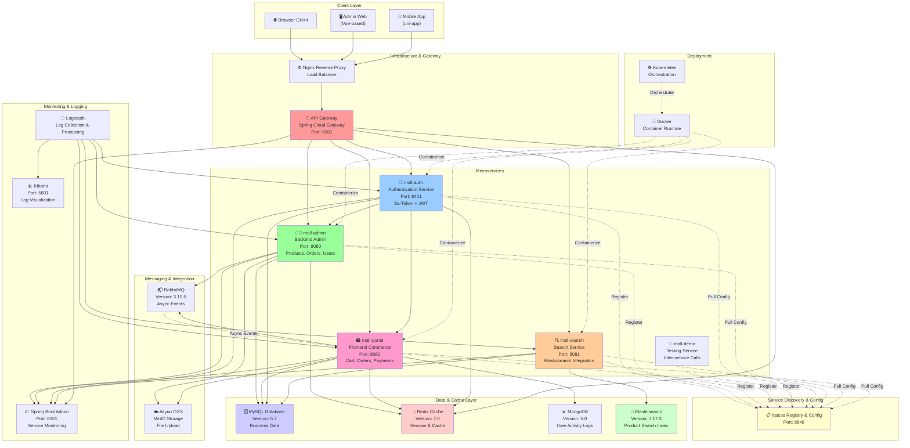
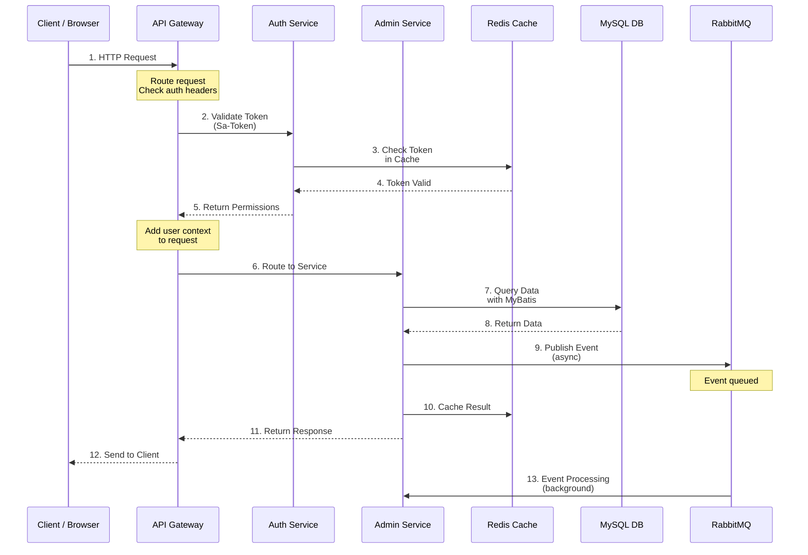
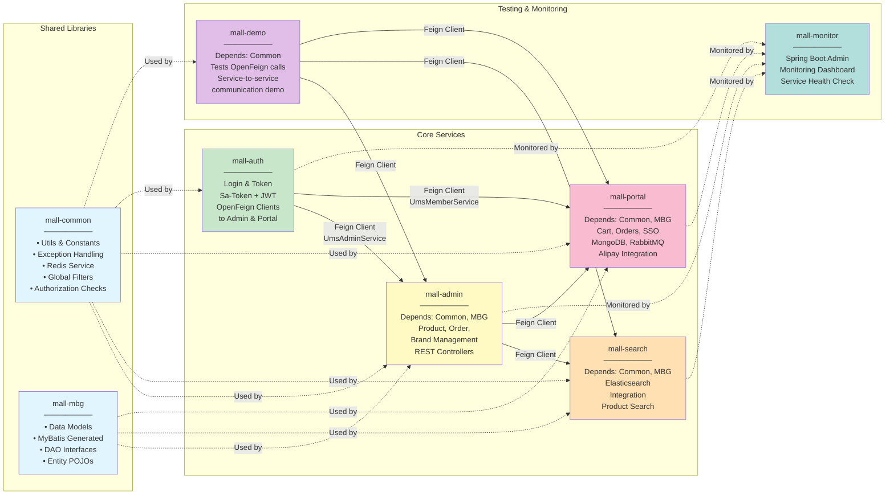
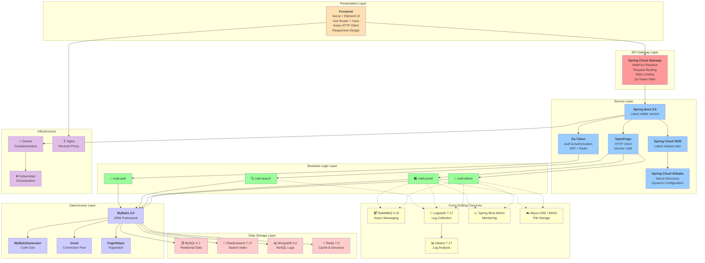
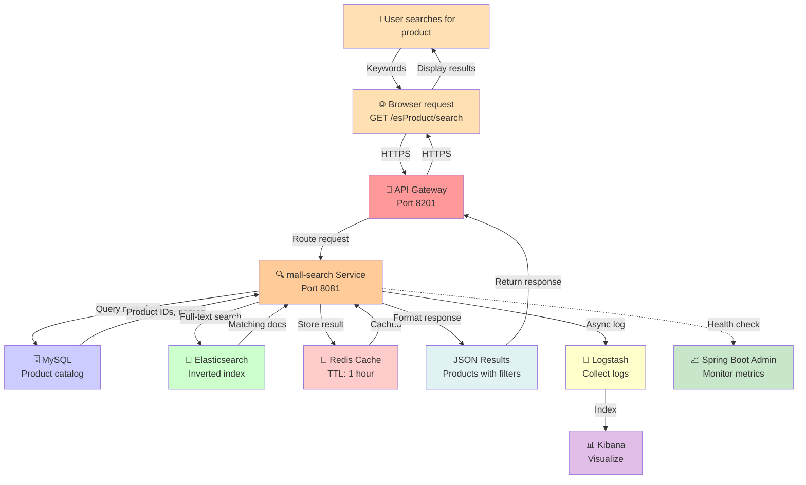
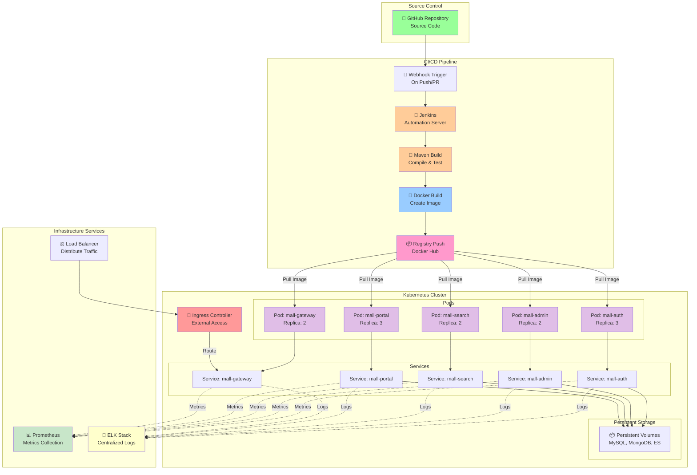
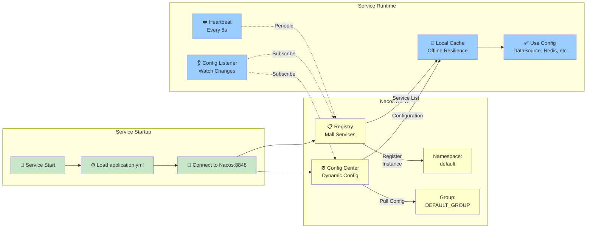
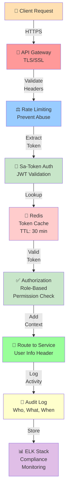

# mall-swarm Architecture Documentation

> Complete microservices e-commerce platform architecture with comprehensive Mermaid diagrams

## Table of Contents
1. [System Architecture Overview](#system-architecture-overview)
2. [Request Flow & Service Communication](#request-flow--service-communication)
3. [Module Dependencies & Organization](#module-dependencies--organization)
4. [Technology Stack by Layer](#technology-stack-by-layer)
5. [Data Flow Example](#data-flow-example)
6. [Deployment Architecture](#deployment-architecture)
7. [Configuration & Service Discovery](#configuration--service-discovery-flow)
8. [Security Architecture](#security-architecture)
9. [Environment Setup](#environment-setup-checklist)
10. [Port Mapping](#port-mapping)

---

## System Architecture Overview

This diagram illustrates the high-level system architecture showing all major components and their interactions:



**Key Components:**
- **Clients**: Admin web portal, mobile app, and browsers
- **Gateway Layer**: Single entry point for all requests with routing and authentication
- **Microservices**: Independent, loosely coupled business services
- **Data Stores**: Multiple specialized databases for different requirements
- **Message Queue**: Asynchronous event processing
- **Monitoring**: Centralized monitoring and logging infrastructure
- **Deployment**: Container and orchestration platforms

---

## Request Flow & Service Communication

This sequence diagram shows how requests flow through the system:



**Flow Description:**
1. Incoming HTTP request from client through gateway
2. Gateway validates authentication token with auth service
3. Token verification against Redis cache for performance
4. Gateway adds user context and routes to appropriate service
5. Service processes business logic using MyBatis ORM
6. Optional: Publish async events for background processing
7. Cache layer stores frequently accessed data
8. Response returned through gateway to client

---

## Module Dependencies & Organization



**Module Responsibilities:**

| Module | Purpose |
|--------|---------|
| **mall-common** | Shared utilities, exception handling, Redis operations, authentication constants |
| **mall-mbg** | Auto-generated MyBatis code, entity models, DAOs |
| **mall-auth** | Token generation, validation, and authorization |
| **mall-admin** | Backend admin operations: products, brands, orders |
| **mall-search** | Elasticsearch integration for product search |
| **mall-portal** | Frontend e-commerce: cart, orders, payments |
| **mall-demo** | Testing service-to-service communication |
| **mall-monitor** | Spring Boot Admin for centralized monitoring |

---

## Technology Stack by Layer



---

## Data Flow Example

This diagram shows a complete product search flow through multiple services:



---

## Deployment Architecture



---

## Configuration & Service Discovery Flow



---

## Security Architecture



---

## Environment Setup Checklist

| Component | Version | Port | Status |
|-----------|---------|------|--------|
| **JDK** | 17 | - | ✅ Required |
| **Maven** | 3.8+ | - | ✅ Required |
| **MySQL** | 5.7 | 3306 | ✅ Primary DB |
| **Redis** | 7.0 | 6379 | ✅ Cache & Session |
| **Elasticsearch** | 7.17.3 | 9200 | ✅ Search Engine |
| **Kibana** | 7.17.3 | 5601 | ✅ Log Visualization |
| **Logstash** | 7.17.3 | 5000 | ✅ Log Collection |
| **MongoDB** | 5.0 | 27017 | ✅ Activity Logs |
| **RabbitMQ** | 3.10.5 | 5672 | ✅ Message Broker |
| **Nacos** | Latest | 8848 | ✅ Registry & Config |
| **Nginx** | 1.22 | 80, 443 | ✅ Reverse Proxy |
| **Docker** | Latest | - | ✅ Containerization |
| **Kubernetes** | 1.24+ | - | ⚙️ Optional |

---

## Port Mapping

| Service | Port | Protocol | Type | Purpose |
|---------|------|----------|------|---------|
| **mall-gateway** | 8201 | HTTP/HTTPS | Public | API Entry Point |
| **mall-admin** | 8080 | HTTP | Internal | Admin Backend |
| **mall-portal** | 8082 | HTTP | Internal | Commerce Backend |
| **mall-search** | 8081 | HTTP | Internal | Search Service |
| **mall-auth** | 8401 | HTTP | Internal | Auth Service |
| **mall-monitor** | 8101 | HTTP | Internal | Monitoring Dashboard |
| **Nacos Console** | 8848 | HTTP | Internal | Service Registry |
| **MySQL** | 3306 | TCP | Internal | Database |
| **Redis** | 6379 | TCP | Internal | Cache Store |
| **Elasticsearch** | 9200 | HTTP | Internal | Search Engine |
| **Kibana** | 5601 | HTTP | Internal | Log Dashboard |
| **RabbitMQ** | 5672 | AMQP | Internal | Message Queue |
| **RabbitMQ Admin** | 15672 | HTTP | Internal | Queue Management |

---

## Key Architecture Principles

### 1. **Microservices Pattern**
- Independent, loosely coupled services
- Each service owns its database
- Service-to-service communication via OpenFeign

### 2. **Service Discovery**
- Dynamic registration with Nacos
- Load balancing across instances
- Automatic health checks

### 3. **Authentication & Authorization**
- Centralized auth service (mall-auth)
- Token-based (JWT) with Redis caching
- Sa-Token framework for fine-grained permissions

### 4. **Data Consistency**
- MySQL for transactional data
- Redis for cache-aside pattern
- MongoDB for activity logs
- Elasticsearch for search indices

### 5. **Asynchronous Processing**
- RabbitMQ for event-driven architecture
- Publish-subscribe messaging patterns
- Background job processing

### 6. **Observability**
- Centralized logging (Logstash + Kibana)
- Application monitoring (Spring Boot Admin)
- Distributed tracing capabilities

### 7. **Deployment & Scaling**
- Docker containerization
- Kubernetes orchestration
- Horizontal scaling support
- CI/CD automation with Jenkins

---

## Quick Start

### Local Development Setup

```bash
# 1. Clone repository
git clone https://github.com/Walton-guud-Kenya/mall-swarm.git
cd mall-swarm

# 2. Build project
mvn clean install -DskipTests

# 3. Start services (requires infrastructure setup)
# See CONTRIBUTING.md for detailed setup instructions

# 4. Access services
# Admin: http://localhost:8080
# Gateway: http://localhost:8201
# Nacos: http://localhost:8848
# Kibana: http://localhost:5601
```

### Production Deployment

```bash
# 1. Build Docker images
mvn clean package -DskipTests -Ddocker.build=true

# 2. Push to registry
docker push your-registry/mall-admin:1.0
# ... push other services

# 3. Deploy to Kubernetes
kubectl apply -f document/k8s/

# 4. Verify deployment
kubectl get pods -n default
kubectl get services -n default
```

---

## References

- **Official Documentation**: [https://cloud.macrozheng.com](https://cloud.macrozheng.com)
- **GitHub Repository**: [https://github.com/macrozheng/mall-swarm](https://github.com/macrozheng/mall-swarm)
- **Learning Tutorials**: [https://cloud.macrozheng.com/video/](https://cloud.macrozheng.com/video/)
- **Spring Cloud Guide**: [https://spring.io/projects/spring-cloud](https://spring.io/projects/spring-cloud)
- **Kubernetes Docs**: [https://kubernetes.io/docs/](https://kubernetes.io/docs/)

---

**Document Version**: 1.0  
**Last Updated**: 2025-07-05  
**Maintainer**: mall-swarm community
